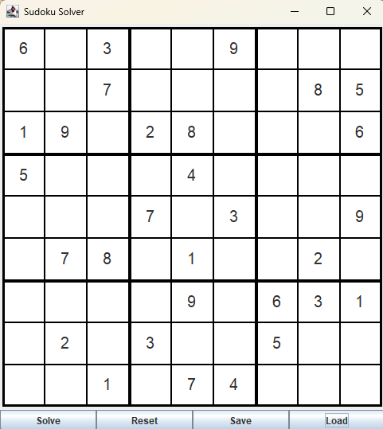

# Sudoku-Auto-Solver Application

# Overview:

This project is a GUI focused Java application that allows users to solve, save, and load Sudoku puzzles through an intuitive user interface. It provides functionalities for inputting Sudoku numbers, validating puzzle entries, solving the puzzle using a backtracking algorithm, and managing puzzle data via saving and loading from text files. The application leverages Java Swing for the GUI, ensuring that the project is a user-friendly experience. I designed and developed this project to help my friend learn Sudoku and check to see if their solution to the puzzle was correct or not.

# Features:
-	Interactive 9x9 Sudoku grid with clear boundaries and separations of 3x3 boxes
-	Input filtering to accept only digits 1-9 in each cell, solving any potential exception handling issues
-	Validation of user inputs to prevent Sudoku rule violations; highlighting cell(s) that are incorrect/break a rule
-	Automated solving of Sudoku puzzles using recursive backtracking algorithms
-	Reset functionality to clear the puzzle
-	Save functionality to save the current puzzle state to a text file
-	Load puzzles from a text file, allowing the user to continue solving/testing with the puzzle
-	User-friendly GUI with easily accessible controls and buttons

# Product Images:

## Technologies Used:
-	Java SE (Standard Edition)
-	Swing library for GUI components
-	Maven (for project build and dependency management)
-	Standard Java I/O libraries for file handling

# Usage Instructions:

# File Pathway Tree/ File Directory:
Please check the File Pathway Tree File found in this project's repository.

## Installation & Setup:
1.	Ensure you have the Java Development Kit (JDK) 11 or higher installed. And is inside of a runnable IDE (Such as IntelliJ IDEA 2025.2).
2.	Download or clone this repository containing the SudokuSolver.java file, pom.xml, and Sudoku_puzzle.txt.
3.	Open the project in an IDE such as IntelliJ IDEA or Eclipse, then run/compile the “SudokuSolver.java” file directly.

## Using the Interface:
-	After running the project, a GUI window titled "Sudoku Solver" will appear, displaying a 9x9 Sudoku grid.
-	Input Cells: Click on any cell to enter a number between 1 and 9. Invalid input will be rejected in real-time and will not be able to be entered into the cells.
-	Solve Puzzle: Click the "Solve" button to automatically solve the current puzzle state. If unsolvable, an alert will notify you, and the cell that is causing the puzzle to be unsolvable will be highlighted to let the user know it needs changed/is incorrect.
-	Reset Puzzle: Click the “Reset" button to clear all inputs and return the grid to an empty state.
-	Save Puzzle: Click the "Save" button to save/write the current puzzle configuration to sudoku_puzzle.txt and override the previously saved puzzle if there is one.
-	Load Puzzle: Click the "Load" button to load the previously saved puzzle from sudoku_puzzle.txt into the grid if there is one. If there is no puzzle to load, the application informs the user that the puzzle could not be loaded.

## How it Works:
-	Users manually input numbers into the grid of the 9x9 sudoku puzzle; the application enforces input validation via Sudoku rules.
-	When the "Solve" button is pressed, the solver program uses the recursive backtracking algorithm to find a solution.
-	Meanwhile the "Reset" button clears the game for a new puzzle.
-	Saving and loading the puzzle via text files allows for persistence between sessions.

# Contributing to the Codebase:
Contributions are encouraged and welcome! Feel free to fork this repository, submit feature enhancements, bug fixes, or improvements to the codebase. Please make sure to follow best practices, keep the code clean, and update documentation where necessary.
